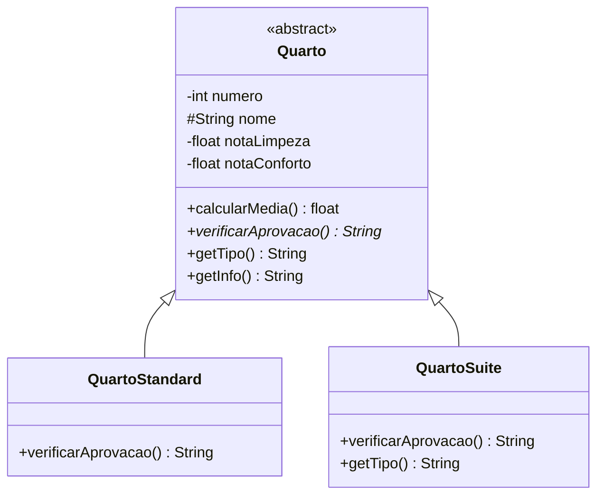

# Padrão Template method

Avaliacao de quartos de um Hotel

Diagrama de classes:

```mermaid
classDiagram
    class Quarto {
        <<abstract>>
        -int numero
        #String nome
        -float notaLimpeza
        -float notaConforto
        +calcularMedia() float
        +verificarAprovacao()* String
        +getTipo() String
        +getInfo() String
    }
    class QuartoStandard {
        +verificarAprovacao() String
    }
    class QuartoSuite {
        +verificarAprovacao() String
        +getTipo() String
    }

    Quarto <|-- QuartoStandard
    Quarto <|-- QuartoSuite
```
